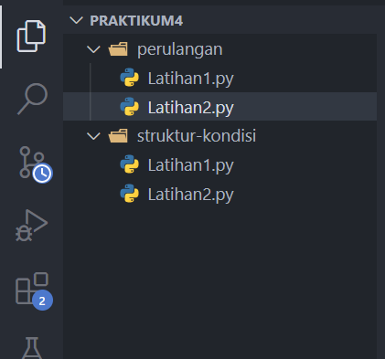
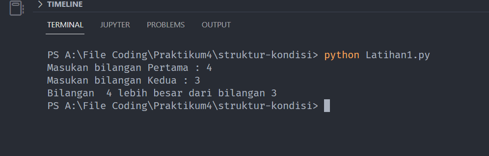
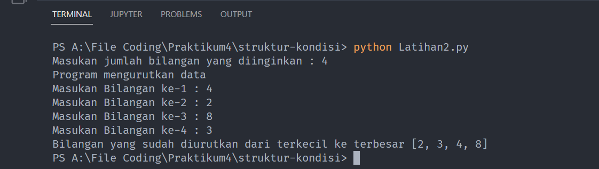
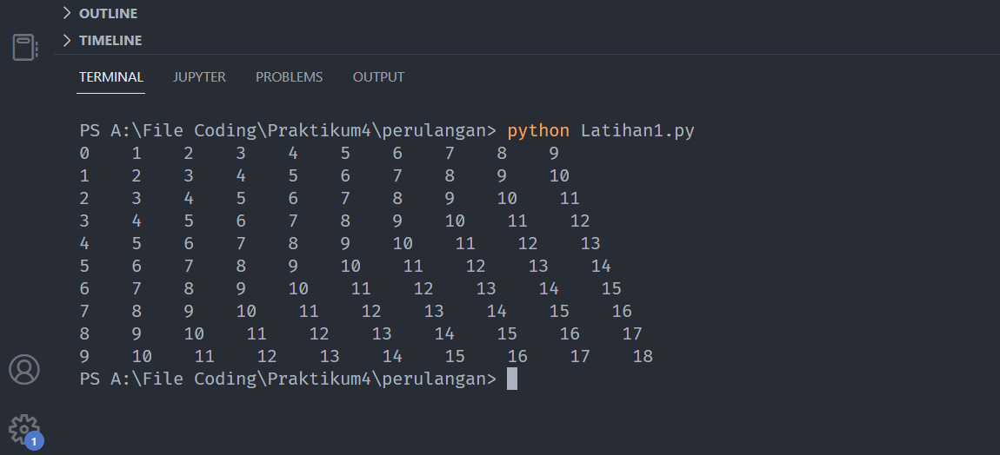
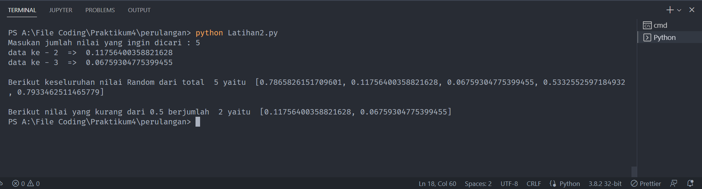

# Praktikum 4 Bahasa pemrograman python
### Belajar Struktur kondisi dan perulangan pada Python

1. Buat folder dengan nama Praktikum4 lalu didalamnya kita buat dua folder yaitu `struktur-kondisi` &` perulangan`  dan didalamnya buat file` Latihan1.py` dan` Latihan2.py` dimasing masing folder . berikut contohnya :

  `NOTE : kalian bebas menamakan folder dan filenya`

   

2. Selanjutnya kita buka file `struktur-kondisi` >` Latihan1.py`... lalu isikan codingan berikut :

   ```python
      # menerima input yang diketik dan menyimpannya didalam variable
    bilanganSatu = input("Masukan bilangan Pertama : ")
    bilanganKedua = input("Masukan bilangan Kedua : ")

    # mengkonversi input string ke integer karena method input() selalu mengembalikan type data string
    bilanganSatu = int(bilanganSatu)
    bilanganKedua = int(bilanganKedua)

    # mengecek untuk menentukan bilangan terbesar dari kedua bilangan
    if bilanganSatu > bilanganKedua:
        print("Bilangan ", bilanganSatu, "lebih besar dari bilangan", bilanganKedua)
    else:
        print("Bilangan ", bilanganKedua, "lebih besar dari bilangan", bilanganSatu)

   ```
   Jika sudah lalu kita jalankan dengan cara ketikan diterminal yaitu `python Latihan1.py` !!! perlu diingat kita harus berada didirektor `struktur-kondisi`. Lalu akan tampil hasilnya seperti dibawah ini

    

3. Selanjutnya kita buka `Latihan2.py` pada folder `struktur-kondisi` lalu ketikan codingan berikut :

   ```python
        # variable angka untuk menampung jumlah angka yang diinputkan berupa array/list
      angka = []
      # variable bilangan untuk menentukan jumlah bilangan yang diinginkan
      bilangan = input("Masukan jumlah bilangan yang diinginkan : ")


      # mengkonversi input string ke integer karena method input() selalu mengembalikan type data string
      bilangan = int(bilangan)

      print("Program mengurutkan data ")

      # melakukan perulangan berdasarkan jumlah dari variable bilangan

      for i in range(0, bilangan):
          # melakukan perulangan  input sampai jumlah dari variable bilangan yang sudah ditentukan
          # misal bilangannya  sama dengan 4 maka akan dimunculkan input 4 kali lalu disimpan di variable => data

          data = int(input("Masukan Bilangan ke-" + str(i+1) + " : "))

          # menambahkan isi dari variable data ke variable angka yang type datanya berupa array
          # contoh input pertama [3] => input ke-dua [3,5] => input ke-tiga [3,5,2] => input ke-empat[3,5,2,9] dan seterusnya sesuai jumlah variable bilangan
          angka.append(data)

      # menampilkan hasil program
      # method sorted() berfungsi untuk mengurutkan nilai dari terkecil ke terbesar,
      print("Bilangan yang sudah diurutkan dari terkecil ke terbesar", sorted(angka))

   ```
      Jika sudah lalu kita jalankan dengan cara ketikan diterminal yaitu `python Latihan2.py` !!! perlu diingat kita harus berada didirektor struktur-kondisi. Lalu akan tampil hasilnya seperti dibawah ini

      

4. Selanjutnya kita buka `Latihan1.py` pada folder `perulangan` lalu ketikan codingan berikut :

   ```python

      # melakukan perulangan dari 0 sampai 10
      for i in range(0, 10):
        # menampilkan variable i , (" " * 3) Artinya menambahkan spasi tiga kali lalu end => yaitu memulai baris baru setelah nilai terakhir
          print(i, " " * 3,  end='')

          # melakukan perulangan dari 1 sampai 10
          for j in range(1, 10):
              # menampilkan output j + i , (" " * 3) Artinya menambahkan spasi tiga kali lalu end => yaitu memulai baris baru setelah nilai terakhir
              print(j+i, " " * 3, end='')
          print()

   ```
      Jika sudah lalu kita jalankan dengan cara ketikan diterminal yaitu `python Latihan1.py` !!! perlu diingat kita harus berada didirektor `perulangan`. Lalu akan tampil hasilnya seperti dibawah ini

      

5. Selanjutnya kita buka `Latihan2.py` pada folder `perulangan` lalu ketikan codingan berikut :

   ```python

      # import module random untuk mengenerate angka acak 0.3222...dst
      from random import random

      # variable jumlahNilai menampung input masukan lalu diconvert ke integer
      jumlahNilai = int(input('Masukan jumlah nilai yang ingin dicari : '))

      # variable nilaiRandom & kurangDariNolKomaLima berupa array/list untuk menyimpan data yang diperlukan nanti.
      nilaiRandom = []
      kurangDariNolKomaLima = []

      # looping data berdasarkan jumlahNilai,
      for i in range(0, jumlahNilai):
          # variable n = menyimpan angka random contoh: 0.9905112793033766
          n = random()

          # menambahkan n ke variable nilaiRandom
          # fungsi append() untuk menambahkan data ke dalam variable yang type datanya berupa array/list
          nilaiRandom.append(n)

          # apakah n < dari 0.5 ? jika iya tampilkan lalu break dan memulai ke angka random selanjutnya
          while n < 0.5:

              # menambahkan n jika kurang dari 0.5 ke variable kurangDariNolKomaLima
              kurangDariNolKomaLima.append(n)

              # menampilkan output n
              print("data ke -", str(i+1), " => ", n)
              break

      print()
      # menampilkan output keseluruhan nilai random
      print("Berikut keseluruhan nilai Random dari total ", jumlahNilai,
            "yaitu ", nilaiRandom)

      print()
      # menampilkan output keseluruhan nilai n < 0.5
      print("Berikut nilai yang kurang dari 0.5 berjumlah ", len(kurangDariNolKomaLima),
            "yaitu ", kurangDariNolKomaLima)


   ```
      Jika sudah lalu kita jalankan dengan cara ketikan diterminal yaitu `python Latihan2.py` !!! perlu diingat kita harus berada didirektor `perulangan`. Lalu akan tampil hasilnya seperti dibawah ini

      

      ### Baik Kurang lebih seperti itu untuk pembelajaran mengenai kondisi dan perulangan pada bahasa pemrogramman python,
      ___________________
       TERIMA KASIH